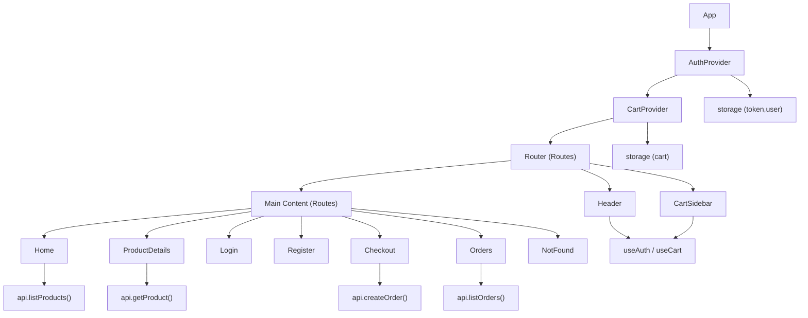

# e_commerce_frontend Internal and API Documentation

## Introduction

This document provides internal and API-level documentation for the ShopEasy React frontend. It covers each module under src/, describing its purpose, public interface (exported functions/components/hooks), props, return values, side effects, usage examples, and integration notes. It is intended for maintainers and integrators who need an accurate reference aligned with the current codebase.

## Architecture Overview

The application is a Create React App (CRA) React 18 single page application using react-router-dom v6. It composes:
- Context providers for authentication and cart state.
- Service layer for HTTP requests to a backend API (using fetch).
- Page components for routes.
- Presentational and layout components (Header, Footer, Product UI, Cart Sidebar).
- Global and theme CSS for styling.

Routing is set up in App.js and bootstrapped by index.js.

## Entry Points

### src/index.js

- Purpose: Bootstraps the React application by rendering App within React.StrictMode and importing CSS baselines.
- Imports: index.css, global.css, theme.css, App.
- Side effects: None beyond DOM rendering.
- Usage: Application root file used by CRA.

### src/App.js

- Purpose: Root component wiring providers, router, layout, and routes.
- Exports: default function App()
- Dependencies:
  - react-router-dom: BrowserRouter as Router, Routes, Route
  - Layout: Header, Footer
  - Features: CartSidebar, Toasts
  - Providers: AuthProvider, CartProvider
  - Pages: Home, ProductDetails, Login, Register, Checkout, Orders, NotFound
- Behavior:
  - Wraps app with AuthProvider and CartProvider.
  - Defines routes:
    - "/" → Home
    - "/product/:id" → ProductDetails
    - "/login" → Login
    - "/register" → Register
    - "/checkout" → Checkout
    - "/orders" → Orders
    - "*" → NotFound
- Integration notes:
  - Ensure server is configured for SPA routing.
  - Order of providers matters: AuthProvider wraps CartProvider so both are available throughout the tree.

## Services

### src/services/api.js

- Purpose: Lightweight API client wrapper around fetch with base URL resolution from environment.
- Base URL: const BASE_URL = process.env.REACT_APP_API_BASE_URL || ''
  - If empty, requests are relative to current origin.
- Internal helpers:
  - buildUrl(path: string): string — joins BASE_URL and path safely.
  - request(path: string, options?): Promise<any>
    - Options: method (default GET), body (object or string), token (string), headers (object)
    - Adds Content-Type: application/json
    - Adds Authorization: Bearer <token> when token provided
    - Parses JSON if possible, else returns text
    - Throws Error with status and data on non-2xx responses
- Exports: api object with methods:
  - listProducts(params = {}): Promise<Array|{items:Array}>
    - Query params supported: q, category, minPrice, maxPrice, sort
  - getProduct(id: string|number): Promise<object>
  - login(email: string, password: string): Promise<{token: string, user: object}>
  - register(name: string, email: string, password: string): Promise<{token: string, user: object}>
  - me(token: string): Promise<object> — current user
  - createOrder(payload: object, token: string): Promise<object> — creates order for authenticated user
  - listOrders(token: string): Promise<Array|{items:Array}> — orders for authenticated user
- Usage example:
  - const products = await api.listProducts({ q: 'shirt', sort: 'price_asc' });
- Integration notes:
  - Backend must implement the documented endpoints and support CORS when cross-origin.
  - Environment variable REACT_APP_API_BASE_URL must be set at build time for production if not using relative paths.

## Utilities

### src/utils/storage.js

- Purpose: Safe wrapper around localStorage with JSON serialization and a namespacing prefix.
- Namespace: 'ecomm'
- Exports:
  - save(key: string, value: any): void
  - load<T>(key: string, fallback: T): T
  - remove(key: string): void
- Behavior:
  - Catches and ignores storage exceptions (e.g., private mode, quota issues).
- Usage example:
  - save('token', 'abc'); const token = load('token', '');

## Contexts

### src/context/AuthContext.js

- Purpose: Provide authentication state and actions globally.
- Storage keys: 'token', 'user' via storage.js; persists across sessions.
- Side effects:
  - On initial mount, attempts to refresh user if token exists by calling api.me(token). On failure, clears token and user.
  - Persists token and user to localStorage on changes.
- Exports:
  - useAuth(): { user, token, loading, login, register, logout }
  - AuthProvider({ children })
- Public interface:
  - user: object|null — current authenticated user
  - token: string — bearer token string ('' when unauthenticated)
  - loading: boolean — indicates in-progress auth operation
  - login(email, password): Promise<{ ok: boolean, message?: string }>
  - register(name, email, password): Promise<{ ok: boolean, message?: string }>
  - logout(): void — clears token and user and removes from storage
- Usage example:
  - const { user, login, logout } = useAuth();
- Integration notes:
  - Backend must return { token, user } on login/register; /auth/me must validate token.

### src/context/CartContext.js

- Purpose: Manage cart items and a UI state for the cart sidebar.
- Storage key: 'cart' via storage.js
- Derived values:
  - subtotal: number — sum of price*qty
  - count: number — total quantity across items
- Exports:
  - useCart(): { items, open, count, subtotal, openCart, closeCart, toggleCart, add, remove, updateQty, clear }
  - CartProvider({ children })
- Public interface:
  - items: Array<{id,title,price,image,qty}>
  - open: boolean — sidebar state
  - count: number
  - subtotal: number
  - openCart(): void
  - closeCart(): void
  - toggleCart(): void
  - add(product, qty = 1): void — increments qty if product exists; opens sidebar
  - remove(id): void
  - updateQty(id, qty): void — enforces qty >= 1
  - clear(): void — empties the cart
- Usage example:
  - const { add, items, subtotal } = useCart();
- Integration notes:
  - Items stored compactly; adapt mapping when backend product schema changes.

## Components

### src/components/layout/Header.js

- Purpose: Top navigation with brand, search, auth links, and cart button.
- Exports: default function Header()
- Internal state: q (search query), controlled by URL search param 'q'.
- Hooks:
  - useAuth(): uses { user, logout }
  - useCart(): uses { count, toggleCart }
  - useSearchParams(), useNavigate() to read/update query params and navigate
- Behavior:
  - Synchronizes input with URL's 'q' param.
  - Auth links vary by user presence; shows Orders and Logout if authenticated.
  - Cart button shows current count.
- Accessibility:
  - Search form has role="search", inputs/controls have aria-labels.
- Integration notes:
  - Search behavior filters Home products by writing 'q' into query string.

### src/components/layout/Footer.js

- Purpose: Footer with brand, links, and contact info.
- Exports: default function Footer()
- Behavior: Static content; uses current year dynamically.
- Accessibility: role="contentinfo".

### src/components/cart/CartSidebar.js

- Purpose: Slide-in cart sidebar listing items, allowing quantity edits, removal, and checkout/login.
- Exports: default function CartSidebar()
- Hooks:
  - useCart(): { items, open, closeCart, remove, updateQty, subtotal }
  - useAuth(): { user }
  - useNavigate(): navigate to checkout
- Behavior:
  - Renders items with image, title, price, quantity controls, and remove.
  - Shows subtotal and either "Proceed to Checkout" or "Login to Checkout".
  - Visibility controlled by CartContext.open; controlled via CSS class "open".
- Accessibility: aria-hidden, aria-labels on buttons and quantity display.

### src/components/common/Toasts.js

- Purpose: Placeholder toast container for future transient message system.
- Exports: default function Toasts()
- Behavior: Renders a div.toast-container; no state or props yet.
- Integration notes: Extend by rendering toast items into this container as needs evolve.

### src/components/products/ProductCard.js

- Purpose: Display a product tile with image, title, price, and add-to-cart button.
- Exports: default function ProductCard({ product })
- Props:
  - product: { id: string|number, title: string, price: number, image?: string }
- Hooks:
  - useCart(): { add }
- Behavior:
  - Image links to /product/:id.
  - Adds product to cart with qty 1 on click.
- Accessibility: aria-labels for navigation and add-to-cart button.

### src/components/products/Filters.js

- Purpose: Filter control set for catalog, synchronized with URL params.
- Exports: default function Filters()
- Internal state: category, minPrice, maxPrice, sort; synchronized from URL via useSearchParams.
- Hooks:
  - useSearchParams(), useNavigate()
- Behavior:
  - update URL query string on Apply/Clear.
  - Home uses the URL to refetch products with corresponding parameters.
- Parameters supported: category, minPrice, maxPrice, sort.

## Pages

### src/pages/Home.js

- Purpose: Product catalog with search and filtering via query params.
- Exports: default function Home()
- Hooks:
  - useSearchParams() to read 'q','category','minPrice','maxPrice','sort'
  - api.listProducts(queryParams) for fetching
- State: loading, products, error
- Behavior:
  - Derives queryParams from URL.
  - Fetches products whenever queryParams change.
  - Displays loading, error toast, and grid of ProductCard components.
- Integration notes:
  - Backend should support the listed query params for product listing.

### src/pages/ProductDetails.js

- Purpose: Display a single product, allow adding to cart.
- Exports: default function ProductDetails()
- Hooks:
  - useParams() to get :id
  - api.getProduct(id) to fetch details
  - useCart().add for cart interactions
- State: product, loading, error
- Behavior:
  - Shows loading and error states; fallback when product not found.

### src/pages/Login.js

- Purpose: Authenticate user and redirect back to previous route or home.
- Exports: default function Login()
- Hooks:
  - useAuth(): { user, login, loading }
  - useNavigate(), useLocation()
- State: email, password, err
- Behavior:
  - If user exists, redirects to previous path (state.from) or "/".
  - Calls login(email, password) and handles result.

### src/pages/Register.js

- Purpose: Create an account and log the user in.
- Exports: default function Register()
- Hooks:
  - useAuth(): { user, register, loading }
  - useNavigate()
- State: name, email, password, err
- Behavior:
  - If user exists, redirect "/".
  - Calls register(name, email, password), navigates home on success.

### src/pages/Checkout.js

- Purpose: Collect shipping and mock payment details and submit an order.
- Exports: default function Checkout()
- Hooks:
  - useCart(): { items, subtotal, clear }
  - useAuth(): { token, user }
  - api.createOrder(payload, token)
  - useNavigate(), Link
- State: form fields (name, address, city, zip, card), processing, err
- Behavior:
  - If not authenticated, shows prompt with link to /login.
  - Builds minimal payload and posts to /orders using token.
  - Clears cart and navigates to /orders with state placed flag on success.
- Integration notes:
  - Replace mock payment with a provider if REACT_APP_PAYMENT_PUBLIC_KEY is provided and integrated.

### src/pages/Orders.js

- Purpose: Show authenticated user order history.
- Exports: default function Orders()
- Hooks:
  - useAuth(): { token, user }
  - api.listOrders(token)
  - useLocation() for success status message
  - Navigate to enforce login
- State: orders, loading, err
- Behavior:
  - Redirects to /login if unauthenticated.
  - Fetches orders when token available; displays loading, error, empty states.

### src/pages/NotFound.js

- Purpose: Display a 404-like message.
- Exports: default function NotFound()
- Behavior: Link back to home.

## Styles

### src/theme.css

- Purpose: Theming variables and component-level styles for layout, grids, buttons, header, footer, and cart sidebar.
- Contains: CSS custom properties for colors, layout dimensions, shadows; styles for header, content, grids, cards, filters, footer, cart sidebar.

### src/global.css

- Purpose: Global base styles and utility classes for layout and typography, plus toast container styles.
- Contains: body baseline, container widths, form and field styles, helpers (.inline, .muted, .center, .right), and toast styles.

### src/index.css

- Purpose: Minimal file to satisfy CRA; base reset resides in global.css.

## Tests and Setup

### src/App.test.js

- Purpose: Smoke test rendering App and verifying the header brand text "ShopEasy" is present.
- Framework: @testing-library/react with jest-dom matchers (see setupTests.js).
- Test: renders header brand.

### src/setupTests.js

- Purpose: Testing setup file importing @testing-library/jest-dom.

## Usage Patterns and Examples

### Accessing Auth and Cart

- Reading auth state:
  - const { user, token } = useAuth();
- Logging in:
  - await login(email, password); // returns { ok, message? }
- Adding to cart:
  - const { add } = useCart(); add(product, 1);

### Programmatic Navigation and Query Sync

- Updating search query in Header:
  - Use useSearchParams and useNavigate to reflect input into URL and let Home read it.

### API Usage

- Product list with filters:
  - await api.listProducts({ q: 'watch', minPrice: 50, sort: 'price_desc' });
- Auth:
  - const { token, user } = await api.login(email, password);
  - const me = await api.me(token);
- Orders:
  - await api.createOrder({ items, shipping, payment, subtotal }, token);

## Integration Notes

- Environment variables: REACT_APP_API_BASE_URL is used by the API client. Other variables documented in README are not directly used by code but may be used by integrators.
- CORS: When backend is hosted on a different origin, ensure proper CORS settings.
- SPA routing: Ensure index.html is served for deep links.
- Storage: Tokens and user profile are stored in localStorage. Consider expiration handling and refresh workflows on the backend.

## Public Interfaces Summary

- Context hooks:
  - useAuth(): { user, token, loading, login(email, password), register(name, email, password), logout() }
  - useCart(): { items, open, count, subtotal, openCart(), closeCart(), toggleCart(), add(product, qty), remove(id), updateQty(id, qty), clear() }
- Services:
  - api.listProducts(params), api.getProduct(id), api.login(email, password), api.register(name, email, password), api.me(token), api.createOrder(payload, token), api.listOrders(token)
- Components (props):
  - ProductCard({ product })
  - Filters() — no props
  - Header(), Footer(), CartSidebar(), Toasts() — no props
- Pages: Home, ProductDetails, Login, Register, Checkout, Orders, NotFound — no external props; driven by router and contexts.

## Mermaid: High-Level Component and Data Flow

## Conclusion

This document reflects the current codebase state and its public interfaces. Use it as the source of truth when integrating backend APIs, extending features, or maintaining the UI and state layers.

## Sources

- e_commerce_frontend/src/App.js
- e_commerce_frontend/src/index.js
- e_commerce_frontend/src/services/api.js
- e_commerce_frontend/src/utils/storage.js
- e_commerce_frontend/src/context/AuthContext.js
- e_commerce_frontend/src/context/CartContext.js
- e_commerce_frontend/src/components/layout/Header.js
- e_commerce_frontend/src/components/layout/Footer.js
- e_commerce_frontend/src/components/cart/CartSidebar.js
- e_commerce_frontend/src/components/products/ProductCard.js
- e_commerce_frontend/src/components/products/Filters.js
- e_commerce_frontend/src/pages/Home.js
- e_commerce_frontend/src/pages/ProductDetails.js
- e_commerce_frontend/src/pages/Login.js
- e_commerce_frontend/src/pages/Register.js
- e_commerce_frontend/src/pages/Checkout.js
- e_commerce_frontend/src/pages/Orders.js
- e_commerce_frontend/src/pages/NotFound.js
- e_commerce_frontend/src/global.css
- e_commerce_frontend/src/theme.css
- e_commerce_frontend/src/index.css
- e_commerce_frontend/src/App.test.js
- e_commerce_frontend/src/setupTests.js
- e_commerce_frontend/README.md
- e_commerce_frontend/package.json
